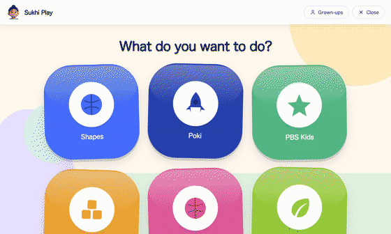
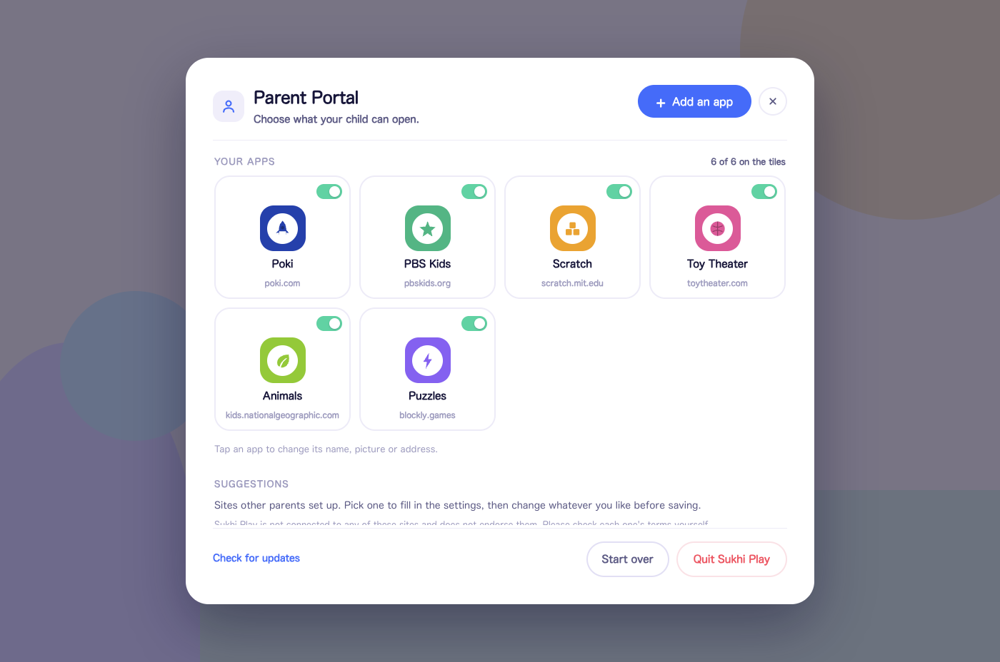

<div align="center">


# Sukhi Play

**A locked-down browser that lets a small child open only what you choose, and nothing else.**

**[sukhiplay.com](https://sukhiplay.com/)**

[](https://github.com/meSingh/sukhi-play/actions/workflows/ci.yml)
[](https://github.com/meSingh/sukhi-play/releases/latest)
[](LICENSE)
[](https://github.com/meSingh/sukhi-play/releases/latest)
[](https://snapcraft.io/sukhi-play)

<a href="docs/macos.md">
  <picture>
    <source media="(prefers-color-scheme: dark)" srcset="docs/badge-macos-dark.svg">
    
  </picture>
</a>
<a href="docs/windows.md">
  <picture>
    <source media="(prefers-color-scheme: dark)" srcset="docs/badge-windows-dark.svg">
    
  </picture>
</a>
<a href="https://snapcraft.io/sukhi-play">
  <picture>
    <source media="(prefers-color-scheme: dark)" srcset="https://snapcraft.io/en/dark/install.svg">
    
  </picture>
</a>



</div>

---

> **2.0.0 is out.** Three apps now ship inside the download -- a colouring book,
> a keyboard playground and first games -- so a fresh install works before the
> wifi does. Play time can be extended by fifteen minutes, an hour or the rest
> of the day without moving your usual limit. The grown-up side is a proper
> screen with tabs, a sum can replace the hold entirely, favicons are gone, and
> there is a new site at **[sukhiplay.com](https://sukhiplay.com/)**.
> [Full notes](https://github.com/meSingh/sukhi-play/releases/latest).

My three-year-old wants to play games. He also clicks every button on the
screen, which means ads, popups, new tabs, and eventually my work. This is the
thing I built so I could hand him the laptop and stop watching over his
shoulder.

He gets a few big colourful buttons. Everything else is switched off: other websites, popups,
new windows, downloads, keyboard shortcuts, the desktop.
Closing it needs an adult.

## Install

On Ubuntu and any other distribution with snap, this is the easiest way and it
updates itself:

```bash
sudo snap install sukhi-play
```

One thing to know about the snap: it runs under strict confinement, which is
what keeps its permissions restricted, and a confined snap is not allowed to
change desktop settings. So it does not borrow Alt+Tab and the Super key the
way the `.deb` and `.AppImage` do. Everything else is identical. If that layer
matters to you, use one of those instead.

On macOS, the two links below always point at the newest release. There is a
[dedicated macOS page](docs/macos.md) covering which one to pick and the
first-launch warning.

| Platform | File |
| --- | --- |
| macOS (Apple Silicon) | **[Sukhi-Play-macOS-AppleSilicon.dmg](https://github.com/meSingh/sukhi-play/releases/latest/download/Sukhi-Play-macOS-AppleSilicon.dmg)** |
| macOS (Intel) | **[Sukhi-Play-macOS-Intel.dmg](https://github.com/meSingh/sukhi-play/releases/latest/download/Sukhi-Play-macOS-Intel.dmg)** |
| Windows 10 / 11 | **[Sukhi-Play-Windows-Setup.exe](https://github.com/meSingh/sukhi-play/releases/latest/download/Sukhi-Play-Windows-Setup.exe)**, or [portable](https://github.com/meSingh/sukhi-play/releases/latest/download/Sukhi-Play-Windows-Portable.exe) |
| Ubuntu / Debian | `.deb` |
| Other Linux | `.AppImage`, `chmod +x` then run |

Everything else is on the
**[latest release](https://github.com/meSingh/sukhi-play/releases/latest)**
page.

> **These builds are signed, but not notarised.** Notarising needs a paid
> Apple Developer account and an EV certificate is needed for Windows, both
> annual, and this is a free project. `SHA256SUMS.txt` is attached to every
> release if you want to check what you downloaded.
>
> **macOS** blocks the first launch with *"Apple could not verify Sukhi Play is
> free of malware"*. Control-clicking the app and choosing *Open* used to get
> past this, but macOS 15 removed that. The route is **System Settings** →
> **Privacy & Security** → **Open Anyway**, under *Security* at the bottom.
> Once per install. [Full walkthrough, with the one-line
> alternative](docs/macos.md).
>
> **Windows** SmartScreen shows *"Windows protected your PC"*. Click **More
> info**, then **Run anyway** — the button only appears after More info.
> [Full walkthrough, including how to check the hash](docs/windows.md).

Or run it from source:

```bash
git clone https://github.com/meSingh/sukhi-play.git
cd sukhi-play
npm install
npm start
```

## First run: a one-minute walkthrough

The first time you open Sukhi Play it asks **who is using the computer right
now**: a grown-up setting it up, or someone just looking. Choose *I'm a
grown-up* and it walks you through four short steps:

1. **What this is.** What your child will and will not be able to reach.
2. **Choose what they can open.** Pick one or two sites from the suggestions.
3. **How you get back out.** It explains the ✕ and the three-second hold, and
   lets you practise the hold once so you know the feel of it.
4. **Hand it over.**

That is the whole setup. Afterwards the walkthrough never appears again, and the
tile screen is what opens.

If the tile screen is ever empty it says so plainly and offers an **Add games**
button that takes you to the grown-up screen, with no hunting through files.

## Adding and removing sites

**Sukhi Play ships with an empty launcher.** It does not pick sites for you. But
it does make picking easy, and you never need to work out hostnames yourself.

Open the grown-up screen (**For grown-ups**, hold 3 seconds) → **Add or remove
games**. Three tabs:

### Suggestions, in one tap

A bundled list of sites other parents use, grouped by category, each labelled
**no ads** or **has ads**. Tap *Add* and it appears on the tile screen.

Nothing here is installed, enabled, or endorsed by this project, and none of
these sites is connected to it. Read [DISCLAIMER.md](DISCLAIMER.md).

| | Site | |
| --- | --- | --- |
| Creative | Scratch | MIT, non-profit, no advertising |
| Learning | Blockly Games | Open source puzzles that teach programming |
| Learning | NASA Space Place | US government, no advertising |
| Learning | Starfall | Letters, phonics, early reading |
| Learning | Nat Geo Kids | Animals and photography |
| Learning | ABCya | Educational games by grade, ad-supported |
| Games | PBS Kids | US public broadcasting, made for pre-schoolers |
| Games | Toy Theater | Simple educational games |
| Games | Poki | Large free game portal, ad-supported |
| Video | YouTube Kids | Ad filtering **off** by design, see below |

### Add an app: type an address and it works out the rest

Type `pbskids.org`. The app opens it once, watches every request it makes, and
tells you:

```
Found 1 host. 2 looked like advertising or tracking and will be blocked.
  pbskids.org
```

Give the tile a name, press **Add**, and it writes the allowlist for you. This
is the same machinery as `npm run check`, driven from the interface. Pick one of
the sixteen shapes and a colour for the tile: a site's own favicon is its
trademark, and this project has no licence to put one on a tile or in a
release.

### Your apps: turn things on and off

Each app is a card shaped like the tile your child sees. The switch in its
corner decides whether it appears on their screen, and tapping the card opens
everything else: name, picture, colour, address, allowed hosts and ad filtering,
with Delete at the bottom.

<div align="center">

</div>

### Leaving a site as its operator intended

Some sites say plainly in their terms that you may not interfere with their
advertising. `blockAds: false` is available on any site you add, for exactly
that case. Containment still applies in full: your child cannot leave the site,
open a popup, or reach anything else.

**youtube.com is deliberately not in the catalogue.** Recommendations, comments
and autoplay make it unsuitable for a small child.

## Editing by hand

Everything above writes to `catalog.json`, which you can edit directly if you prefer.

| Field | Meaning |
| --- | --- |
| `id` | Unique short name, no spaces |
| `title` | Caption under the tile |
| `url` | The page that opens |
| `shape` | `star` `rocket` `ball` `blocks` `note` `leaf` `drop` `bolt` |
| `color` | Tile colour, `#rrggbb` |
| `allowHosts` | **Only** these hosts may load. `example.com` also covers `a.example.com`, never `evil-example.com` |
| `denyHosts` | Overrides `allowHosts`, for ad subdomains of an allowed domain |
| `blockAds` | `false` leaves the site's advertising alone |
| `enabled` | `true` to show the tile |

Check your work from a terminal:

```bash
npm run probe -- --probe=https://example.com   # what hosts does this site need?
npm run check -- --check=my-games              # does my profile actually work?
```

## What your child sees

1. **A loading screen.**
2. **The picker.** Big square tiles, one per site, each a bold colour and a
   simple shape. No reading needed.
3. **The site**, with a thin bar on top: a large blue **Back** button and a small
   grey **✕** in the corner.

The tile screen scrolls once there are more games than fit on the screen, so
nothing ends up stranded above or below where a small child cannot reach it.

There is no fullscreen button. The app already covers the screen, and there is
nothing a child can press to shrink it.

## How the lockdown works

Six independent layers, so no single mistake opens a hole.

**1. An allowlist per site.** Each entry lists the only hosts allowed to load
*anything at all*. Every other request is cancelled: image, script, frame, websocket. This layer does most of the work: it blocks ad networks nobody has
heard of yet, because they are not on the list.

**2. An ad and tracker blocklist.** ~110 known ad, tracker and popunder domains
plus URL patterns, checked *even on allowed hosts*. This catches ad code served
from a site's own CDN, which an allowlist alone cannot see.

**3. No new windows.** Every popup, `target="_blank"` and `window.open` is
denied. If the link was to an allowed page it opens in place instead, so nothing
appears broken.

**4. No navigating away.** Any attempt to move the page, a frame, or a redirect
to a non-allowlisted host is cancelled. Non-web schemes (`mailto:`, `steam:`,
`file:`) are refused, so no page can launch another program.

**5. No keyboard escapes, but games keep their keys.** A page-level filter
swallows modifier combinations, function keys, devtools and reload. A second
OS-level layer takes 64 shortcuts away from the window manager itself, including
`Cmd/Alt+Tab`, Mission Control and Spotlight.

What still reaches the game: **arrow keys, WASD and every other letter, the
digits, space, Enter, Escape, and Ctrl or Shift pressed on their own.** A
modifier held by itself is a game action; only a modifier *combined* with
another key is a shortcut. The page is given keyboard focus on load and whenever
it returns from the exit gate.

**6. Nothing else.** Downloads cancelled. Right-click, devtools and `alert()`
traps disabled. All permissions denied except fullscreen and pointer lock. No
app menu. Bad certificates never overridable. Its own browser profile, entirely
separate from yours.

## The window

The app does **not** use native fullscreen, deliberately. On macOS a
native-fullscreen app gets its own Space, and a three-finger swipe slides
straight past it to the desktop.

Instead the window is frameless, fixed, sized to the whole display, and kept at
`screen-saver` level so it sits above the Dock and menu bar. On macOS it also
joins every Space, so swiping brings the window along rather than revealing
what is behind it.

A site that asks for fullscreen with its own button still gets it. The bar
slides away and **Esc** brings it back.

## Getting in: the hold, and the sum

Pressing **Close** or **Grown-ups** asks for a button held down for three
seconds. A toddler does not manage that by accident, but a toddler who uses the
app every day learns it eventually, which is exactly what happened here.

So Settings offers a second step: **hold and a sum**. After the hold you answer
a small addition, two numbers between two and nine. A wrong answer gets a fresh
pair, three wrong answers wait ten seconds, and the question is made and marked
in the main process, never in the page. A child who has learned to hold a
button has not learned to add.

A PIN still works for anyone who prefers one: set `gateMode` to `pin` and a
`pin` in `settings.json`.

New installs finish the walkthrough on the recommended settings: twenty minutes
of play, and the sum on the way in. Settings has a button to put them back.

## Play time

Set a session length at the top of the grown-up screen: ten minutes to an
hour, or no limit. A countdown sits in the bar where your child can see it,
warnings come at five minutes and at one, and when the time is up they get a
stop screen and nothing else opens.

Only the three second hold starts another session. The clock is counted in the
main process, never in the page: a site your child is on shares that page's
process, and a clock a game could stop is not a clock. The gate and the portal
pause it, so setting up a new site does not spend your child's afternoon.

It is a session, not a day. Nothing is stored between runs, because a stored
daily total invites the question "what counts as a day", and answering it
wrongly means telling a two-year-old their time is gone at breakfast.

## The grown-up gate

Press ✕, or **Ctrl+Shift+X** (**Cmd+Shift+X** on a Mac).

**Grown-ups** opens the portal. **Close** quits. Either way you hold a button
for 3 seconds first, and the gate says which one you asked for.

The hold is **timed in the main process**, not the page. The animation is only
for you to look at, and letting go early gets you nothing.

Inside the portal, besides adding and editing apps:

- **Check for updates** asks GitHub whether a newer release exists and links to
  it. It reports only. Nothing is downloaded or installed, because a kiosk that
  can rewrite itself is a worse problem than one that is out of date.
- **Start over** wipes every app and setting and restarts into the walkthrough.
  It asks twice and cannot be undone.

> A `.deb` or `.dmg` you installed by hand is not tracked by your system's app
> store, so it will never offer you an update. That is how manual packages
> work rather than a fault in this app. Use **Check for updates** and download
> the new one.

Want more? Set a PIN in `settings.json` and you will be asked for it after the
hold:

```json
{ "gateMode": "pin", "pin": "4821" }
```

### Settings

| Setting | Default | What it does |
| --- | --- | --- |
| `gateMode` | `"hold"` | `"hold"`, or `"pin"` to also require a PIN |
| `holdSeconds` | `3` | Seconds the exit button must be held (1–15) |
| `kiosk` | `true` | Cover the whole screen, no window chrome |
| `alwaysOnTop` | `true` | Keep the window above everything else |
| `refocusOnBlur` | `true` | Pull the window back if the child clicks away |
| `showBlockCounter` | `true` | Show "N ads blocked" in the bar |
| `onboarded` | `false` | Set to `false` to see the first-run walkthrough again |
| `borrowDesktopShortcuts` | `true` | Linux/GNOME only. Switch the desktop's Alt+Tab and Super key off while the app runs, then restore them |

`refocusOnBlur` switches itself off if it ever starts fighting another window,
so it can never make the machine unusable.

## What this cannot do

**Blocked at the OS level while the app is in front:** `Cmd/Alt+Tab`, `F1`–`F20`,
Mission Control and Spaces, Spotlight, `Cmd/Ctrl+Q W M H N T R P S O F J L D U`,
devtools shortcuts, zoom, `Alt+F4`, and screen capture (`Print Screen` and its
variants, `Cmd+Shift+3/4/5/6`). Released the moment the window loses focus.

**Not blocked, on purpose:**

- **Force Quit.** `Cmd+Alt+Esc` on macOS, `Ctrl+Alt+Del` on Windows, and
  `Ctrl+Shift+Esc`. Left alone so the machine can always be recovered. Do not
  add these.

**Held a different way, because Windows will not hand it over:**

- **The Windows key.** A bare `Super` accelerator is rejected by Electron
  outright, and Windows refuses `Super+D`, `Super+E`, `Super+R`, `Super+L`,
  `Super+Tab`, `Super+Shift+S` and the rest when asked for them. Only
  `Super+V`, `Super+Plus` and `Super+-` are handed over, and those are taken.

  So pressing it opens the Start menu over the kiosk, and asking for focus back
  does nothing: Windows refuses a foreground request from a background process,
  and Start is drawn above every application window regardless of always-on-top.

  What works is Escape. While the lockdown is on, a PowerShell helper watches
  for the Start menu, Search and the quick settings panel, presses Escape on
  whichever appeared and brings the window back to the front, measured at about
  a quarter of a second. Any other foreground window is left alone, so keys are
  never sent into a dialog. The helper starts with the lockdown and stops with
  the app; nothing is installed and nothing on the machine is changed.

  Run `npm run start-probe` to watch it happen, and `npm run key-probe` to
  re-measure which keys this OS hands over.

**On Linux the desktop's own shortcuts are borrowed, not blocked.** Alt+Tab and
the Super key belong to GNOME rather than to any application, and under
**Wayland**, the default on current Ubuntu, an application cannot intercept keys
at all: Electron's global shortcuts are an X11 facility, and on Wayland they
report success and catch nothing.

So on a GNOME session Sukhi Play switches those bindings off in GNOME's own
settings while it runs, and puts them back exactly as they were when it quits.
25 of them, including Alt+Tab, the Super key, workspace switching and the
screenshot keys.

Every original value is written to disk before anything changes, so a crash
cannot leave you without Alt+Tab: the next start finds the backup and restores
from it. Set `borrowDesktopShortcuts` to `false` in `settings.json` if you would
rather it left your desktop alone.

On a desktop other than GNOME, choose **Xorg** at the login screen (the gear on
the password field) for the in-app layer to work at all. The app says which
session it found:

```
[gnome] borrowed 25 desktop shortcuts, including Alt+Tab and the Super key
[gnome] originals saved to ..., restored when this app quits
```

**Cannot be blocked by any application:**

- **Hardware media keys.** On a Mac, F-keys report as brightness, volume or
  Launchpad unless "Use F1, F2 as standard function keys" is on. The key never
  arrives as `F4`, so nothing can catch it.
- **Trackpad swipes between Spaces.** Handled by the window manager, never
  delivered to applications. The window follows onto the new Space, so your
  child still lands on Sukhi Play.

For a guarantee rather than a very good default, use a **separate user account**
for your child, or Windows **Assigned Access** (Settings → Accounts → Set up a
kiosk). Both are per-account and leave your own login untouched.

**This is not a substitute for supervision.** It reduces what a small child can
reach; it does not childproof a computer.

### Reporting a layout or window bug

Window geometry cannot be reasoned about from another machine, so send real
numbers rather than a description. Close the app, then run the installed copy
with `--diagnose` (the exact line for each system is on the
[troubleshooting page](https://sukhiplay.com/debug/)), or
from a clone:

```bash
npm run diagnose
```

It prints the display bounds, the window bounds, whether the window believes it
is fullscreen, the session type (X11 or Wayland), the in-game bar height, and
the measured position of the top bar, then quits. **Content size must equal
display bounds.** A top bar reporting `top: 0` with a positive height is
correctly placed; a negative top, or a window whose `y` is above the display's,
means the window manager and the app disagree.

Every run also saves what it printed as `sukhi-play-diagnose.txt` on the
Desktop (`--cover-probe` and `--key-probe` do the same under their own names),
because an installed Windows app does not print to the terminal it was started
from.

The diagnostic deliberately runs with the lockdown off, so it opens an ordinary
window and does not borrow any desktop shortcuts.

On Linux, running Electron from a fresh clone can fail with `The SUID sandbox
helper binary was found, but is not configured correctly`, because
`node_modules/electron/dist/chrome-sandbox` is not installed root-owned. Add
`--no-sandbox` for local runs; it does not affect window geometry:

```bash
./node_modules/.bin/electron . --diagnose --no-sandbox
```

Packaged builds are unaffected: the installers set the helper up correctly.

## If it ever locks you out

The app is built to **fail open**. If the launcher does not appear within 12
seconds, or its window crashes, everything unlocks by itself: the 64 keyboard
shortcuts are handed back for the rest of the session, always-on-top and screen
covering are switched off, the window becomes an ordinary one you can close, and
a plain message explains what happened. A kiosk with no visible exit gate must
not also be holding `Cmd+Q`.

If you still need to get out:

- **Force Quit.** `Cmd+Alt+Esc` on macOS, `Ctrl+Alt+Del` on Windows. Never
  captured, on purpose.
- **From a terminal**, if you can reach one: `pkill -f "Sukhi Play"`

When testing changes, give any run a hard deadline so it cannot take over the
machine:

```bash
SUKHI_EXIT_AFTER=15 npm start    # quits itself after 15 seconds
npm run dev                      # no screen covering, no shortcut capture
```

## Development

```bash
npm run dev      # no screen-covering, no OS shortcut capture
npm test         # unit tests
npm run check    # drive a real site, report what loaded and what was cut
npm run probe -- --probe=https://example.com   # derive an allowlist for a site
npm run diagnose # print window and layout geometry, then quit
npm run pack     # unpackaged build
npm run dist     # installers for the current platform
```

Use `npm run dev`, not `npm start`, while working. See
[CONTRIBUTING.md](CONTRIBUTING.md).

```
src/
  main/
    index.js       startup, IPC, the grown-up gate, --check mode
    windowing.js   the window, its two views, and the mode machine
    security.js    request filtering, navigation blocking, permissions
    hosts.js       host matching (label-aware, so lookalikes never match)
    blocklist.js   ad/tracker domains and URL patterns
    keyboard.js    which keys live and which die, inside the page
    shortcuts.js   takes 64 shortcuts off the OS while focused
    catalog.js     loads and sanitises catalog.json
    settings.js    loads and sanitises settings.json
    library.js     the parent's site list, and the bundled suggestions
    probe.js       visits a site once and works out the allowlist it needs
  preload/
    shell.js       the only bridge between the UI and the app
    guest.js       runs in the page: hides leftover ad boxes
  renderer/        loading screen, tiles, bar, gate
```

The window holds two views: our own local UI and the site. The local UI is
always topmost, so the site can never paint over it, and showing the gate is
just a matter of growing our view to fill the window. The renderer runs
sandboxed under a strict CSP and can only reach the app through a handful of
named calls.

## Releasing

Tag it. CI builds all three platforms and publishes the installers.

```bash
npm version patch   # or minor / major
git push --follow-tags
```

The workflow refuses to publish if the tag and `package.json` disagree, or if
the tests fail.

**Sign the tag.** `npm version` makes an annotated tag, and an annotated tag
carries its own signature rather than inheriting the commit's, so an unsigned
one shows as *Unverified* on GitHub even when every commit under it is signed.
Releases here are immutable, which means a tag cannot be replaced once it is
published -- so this has to be right the first time:

```bash
git config tag.gpgsign true   # once per clone
```

v2.0.0 went out unsigned before this was noticed. It cannot be re-tagged.

## Licence

Code is [MIT](LICENSE). **The Sukhi character artwork is not**, and the terms
for it are in [NOTICE](NOTICE). It belongs to
Mandeep Singh. If you fork this and ship your own builds, replace it first;
`python3 branding/generate-mascot.py` swaps in an MIT placeholder. See
[branding/README.md](branding/README.md).

If it saved you an afternoon, you can
[buy me a coffee](https://www.buymeacoffee.com/msingh). Entirely optional, and
the app is free either way.

- [DISCLAIMER.md](DISCLAIMER.md): what this is, and what you are responsible for
- [SECURITY.md](SECURITY.md): reporting a kiosk escape
- [CONTRIBUTING.md](CONTRIBUTING.md): the rules this project lives by

<p align="center">
  <a href="https://www.msingh.com">
    
  </a>
</p>
