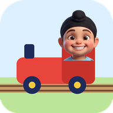

<div align="center">


# Sukhi's Railway

**Build a track. Press go. Watch Sukhi drive it.**

For children of about three to five. No reading, no losing, nothing to buy.
</div>

---

A toy for the little brother, made after the colouring book stopped being
enough. He lays track across a grass board, presses the big green button, and
Sukhi drives it: over the bridge with a splash, through the tunnel, past the
bell, into the car wash, and into the station, where the animals get on and
off.

## What he does

| | |
| --- | --- |
| **Lay track** | Drag a finger across the squares and the track follows it, straights and curves by themselves. Or tap a piece in the tray, then a square: it goes in turned to join the track beside it. A tap on it again turns it round. |
| **Special pieces** | Station, bridge, tunnel, ramp, bouncy pad, bell, car wash. Each one does something as the train passes. |
| **Go** | The big button. On a loop the train goes round and round; on a line it goes to the end, bumps, and backs up. Any track at all has somewhere to go. |
| **Train, car or bus** | Sukhi drives whichever he picks, and his face follows the ride: grinning, laughing on the jump, silly in the tunnel, proud at the station. |
| **Slow or fast** | The tortoise and the hare. |
| **My tracks** | Every track keeps itself on the device. Open one, start a new one, or throw one away (after a question). |

Undo is always there, and the rubber takes pieces away, so nothing he does
leaves him stuck.

## Built the same way as the others

- **Offline and private.** Nothing is fetched and nothing is collected. His
  tracks are in this browser's storage and nowhere else.
- **No text a child needs.** Every control is a picture, at least 64px, and
  reachable by touch, mouse and keyboard.
- **Keyboard.** Tab to the board; arrows move the square; Enter or Space puts
  the piece; Shift and an arrow lays track that way; Delete takes one away;
  1 to 9 pick a piece; G is go; Ctrl or Cmd and Z undo.
- **Everything is drawn in code.** Track, pieces and vehicles are shapes, and
  every sound is synthesised in the same friendly scale as Sukhi Colouring's,
  so there are no image or audio files to license.

## Building it

```
npm install
npm run dev      # http://localhost:5180
npm run build    # into dist/
```

Plain TypeScript and Vite, no framework, no runtime dependencies. The icons
come from `scripts/build-icons.py`.

## Licence

The code is under the [Sukhi Play Personal Use Licence 1.0](LICENSE): free for
individuals and families, never for commercial use.

**Sukhi's pictures are not covered by the code's licence.** They are a
likeness of a real child. `src/assets/sukhi/` and the icons in `public/` are ©
Mandeep Singh, all rights reserved, and may not be reused, modified or
redistributed.
